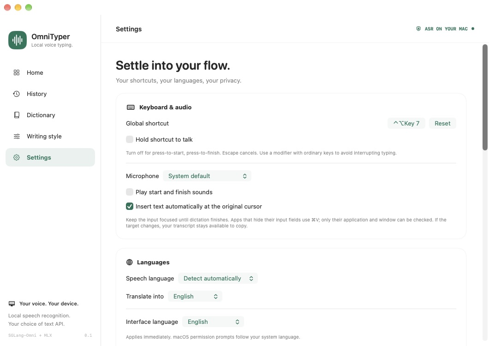
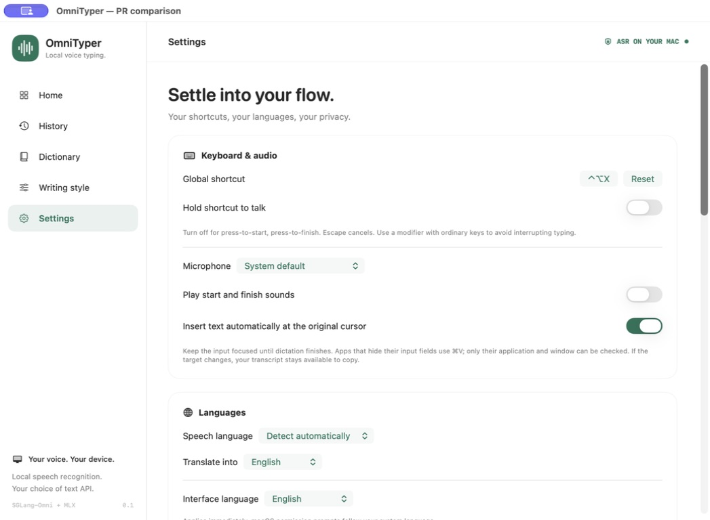
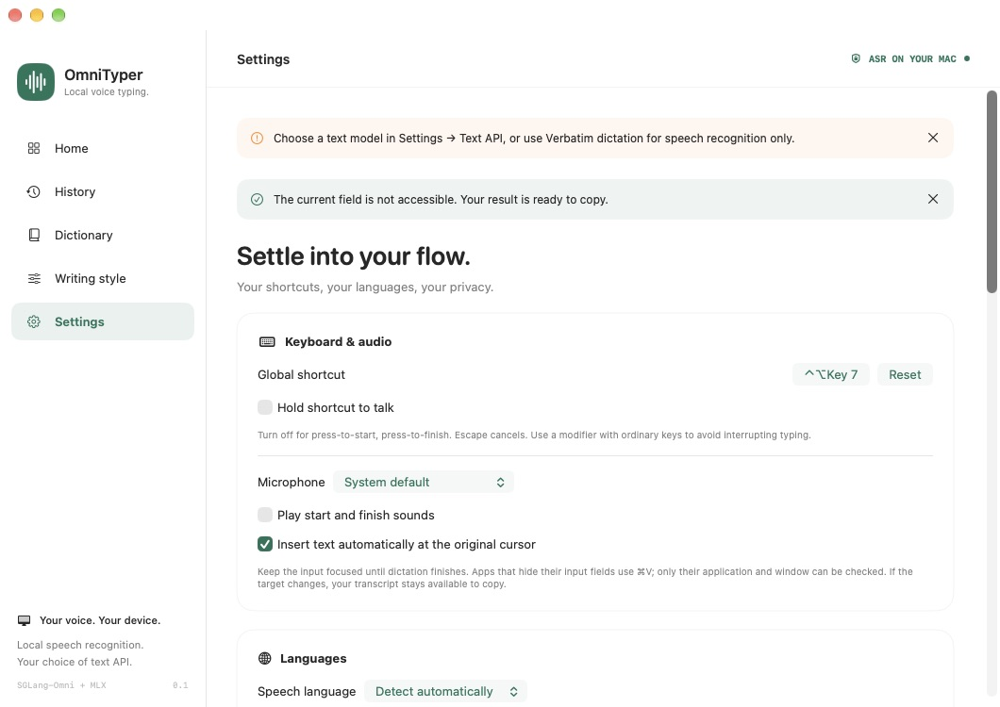
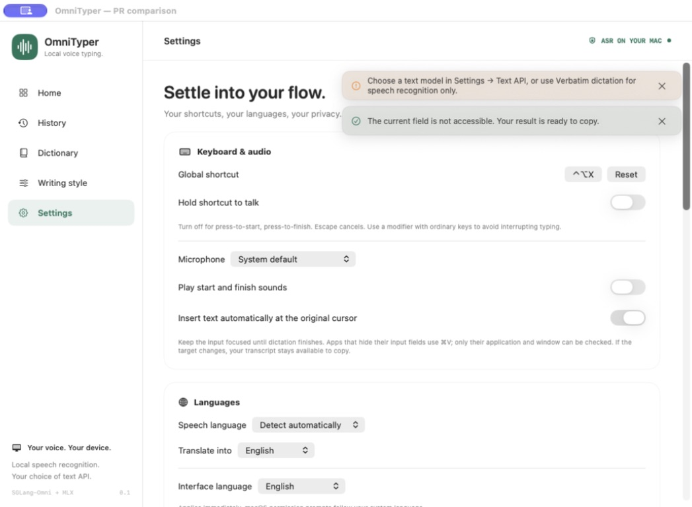
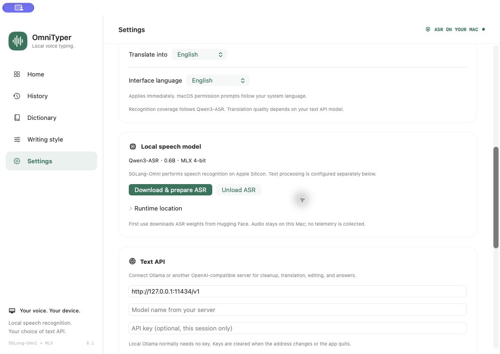
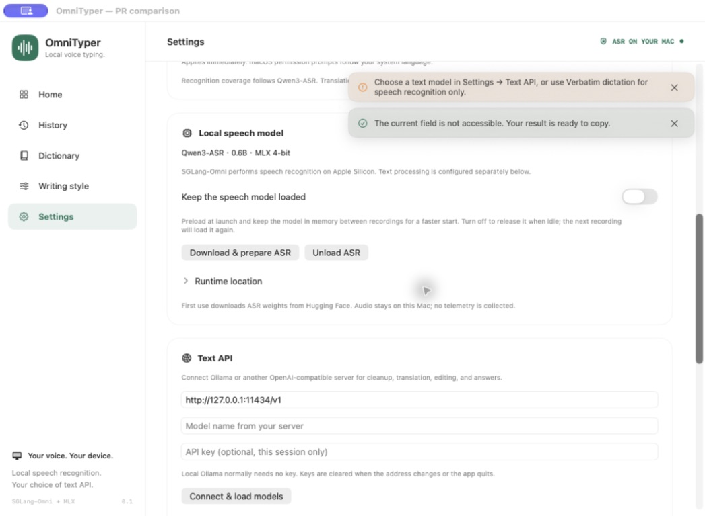
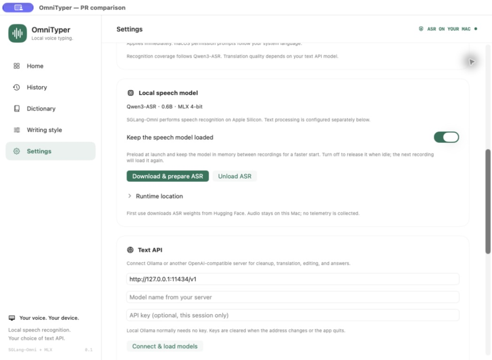
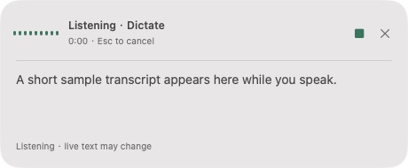
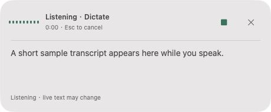

# OmniTyper conservative usability comparison

Baseline: `524a3843`. Reviewed change: `fa5305ca`.

Native window screenshots of production views using isolated sample data. The comparison window title and scenario controls belong only to the fixture. No microphone capture, external text API, or personal settings were used. Screenshots are unedited; the purple title-bar indicator is macOS screen-capture UI. Interaction behavior is covered by the tests and native checks described in the PR.

## Console and shortcuts

Consistent native title bar, full-row switches, and Control–Option–X displayed as X instead of Key 7.

| Before | After |
| --- | --- |
|  |  |

## Notifications at the top of Settings

Notices float independently instead of pushing the settings cards down.

| Before | After |
| --- | --- |
|  |  |

## Notifications after scrolling

The same messages remain visible while viewing lower settings.

| Before | After |
| --- | --- |
|  |  |

## Local speech model

An opt-in retention setting preloads at launch and keeps the model ready between recordings.

| Before | After |
| --- | --- |
|  |  |

## Recording popup

The existing popup retains its layout, with a draggable header and 32-point Stop/Cancel targets.

| Before | After |
| --- | --- |
|  |  |

